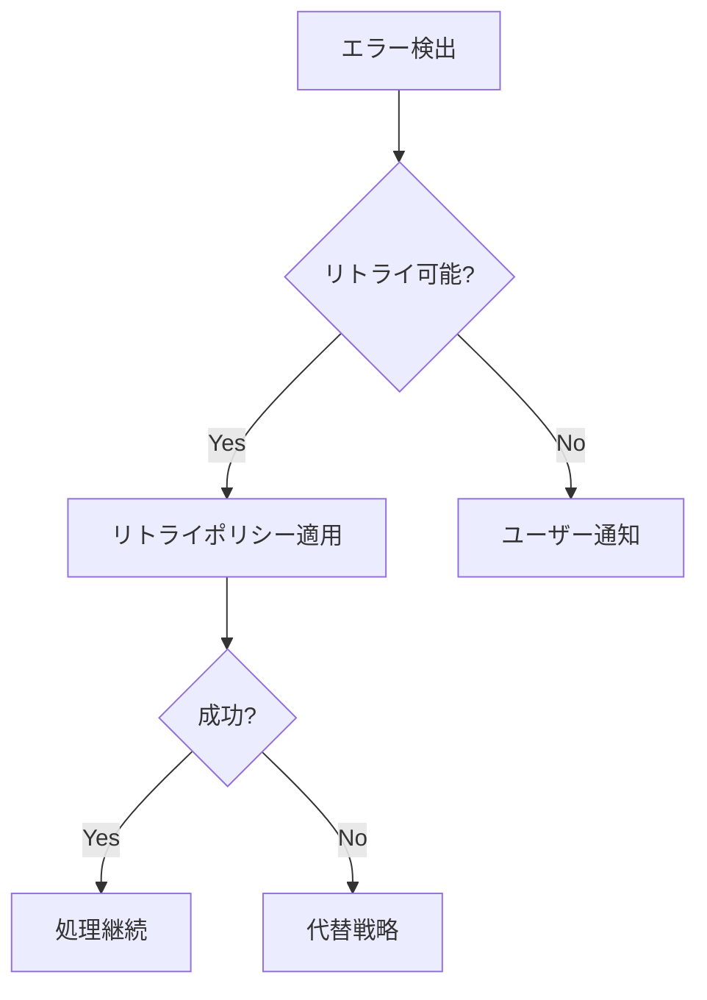

# エラーハンドリング層

## 概要

全エージェント共通のエラーハンドリング仕様を定義し、一貫性のあるエラー処理と復旧戦略を提供します。

## エラーコード体系

### エラーレベル

| レベル | 説明 | 自動復旧 | ユーザー通知 |
|-------|------|---------|-------------|
| CRITICAL | システム停止を要する致命的エラー | ❌ | 必須 |
| ERROR | 処理失敗だが継続可能 | 場合による | 必須 |
| WARNING | 品質低下の可能性あり | ✅ | 推奨 |
| INFO | 情報提供のみ | - | 任意 |

### エラーコード

```yaml
errors:
  # 入力検証エラー (1xxx)
  E1001:
    level: ERROR
    message: "入力JSONが不正です"
    recovery: "JSONスキーマに従った形式で再入力"

  E1002:
    level: ERROR
    message: "必須フィールドが不足しています: {field}"
    recovery: "不足フィールドを追加して再実行"

  E1003:
    level: WARNING
    message: "モジュール数が推奨上限を超えています（上限: 50）"
    recovery: "自動的に処理継続、ただし性能低下の可能性"

  # スコアリングエラー (2xxx)
  E2001:
    level: ERROR
    message: "スコア値が範囲外です: {score}"
    recovery: "1-5の整数値に自動補正"

  E2002:
    level: WARNING
    message: "証拠不足によりスコアリング精度低下"
    recovery: "デフォルト値（3）を使用"

  E2003:
    level: ERROR
    message: "分類規則の適用に失敗"
    recovery: "スコアを再計算して分類規則を再適用"

  # 統合エラー (3xxx)
  E3001:
    level: ERROR
    message: "エージェント間の出力形式不整合"
    recovery: "出力を正規化して再統合"

  E3002:
    level: WARNING
    message: "重複するサブドメインを検出: {domain}"
    recovery: "最新の分析結果を採用"

  # システムエラー (4xxx)
  E4001:
    level: CRITICAL
    message: "メモリ不足"
    recovery: "処理を中断、バッチサイズを削減して再試行"

  E4002:
    level: ERROR
    message: "タイムアウト: {agent}"
    recovery: "該当エージェントを再実行"

  E4003:
    level: ERROR
    message: "エージェント応答なし: {agent}"
    recovery: "代替エージェントで処理"
```

## リトライポリシー

### 基本設定

```yaml
retry_policy:
  max_attempts: 3
  base_delay: 1000  # ミリ秒
  max_delay: 10000
  multiplier: 2
  jitter: true
```

### エラー別リトライ戦略

| エラーコード | リトライ可否 | 戦略 | 最大試行 |
|------------|-----------|------|---------|
| E1xxx (入力) | ❌ | なし（ユーザー修正要） | 1 |
| E2xxx (スコアリング) | ✅ | 指数バックオフ | 3 |
| E3xxx (統合) | ✅ | 固定間隔 | 2 |
| E4001 (メモリ) | ✅ | 段階的縮小 | 3 |
| E4002 (タイムアウト) | ✅ | 線形増加タイムアウト | 3 |
| E4003 (応答なし) | ✅ | 代替エージェント | 2 |

### リトライ実装例

```python
import time
import random
from typing import Callable, Any, Optional

class RetryHandler:
    def __init__(self, config: dict):
        self.max_attempts = config.get('max_attempts', 3)
        self.base_delay = config.get('base_delay', 1000)
        self.max_delay = config.get('max_delay', 10000)
        self.multiplier = config.get('multiplier', 2)
        self.jitter = config.get('jitter', True)

    def execute_with_retry(
        self,
        func: Callable,
        error_code: str,
        *args,
        **kwargs
    ) -> Any:
        attempt = 0
        delay = self.base_delay

        while attempt < self.max_attempts:
            try:
                return func(*args, **kwargs)
            except Exception as e:
                attempt += 1
                if attempt >= self.max_attempts:
                    raise ErrorWithCode(error_code, str(e))

                if self.jitter:
                    delay = delay + random.randint(0, delay // 2)

                time.sleep(delay / 1000)
                delay = min(delay * self.multiplier, self.max_delay)

        raise MaxRetriesExceeded(error_code)
```

## エラー状態からの復旧フロー

### 1. 即時復旧（自動）



### 2. 段階的劣化（Graceful Degradation）

```yaml
degradation_strategies:
  memory_pressure:
    - action: "バッチサイズを50%削減"
      condition: "メモリ使用率 > 80%"
    - action: "並列度を1に削減"
      condition: "メモリ使用率 > 90%"
    - action: "処理中断"
      condition: "メモリ使用率 > 95%"

  timeout:
    - action: "タイムアウト値を2倍に"
      condition: "初回タイムアウト"
    - action: "簡略版エージェントに切替"
      condition: "2回目タイムアウト"
    - action: "処理中断"
      condition: "3回目タイムアウト"

  quality:
    - action: "完全分析"
      condition: "証拠十分（>10件）"
    - action: "簡易分析"
      condition: "証拠不足（5-10件）"
    - action: "デフォルト値使用"
      condition: "証拠僅少（<5件）"
```

### 3. 状態保存と復旧

```yaml
checkpoint:
  enabled: true
  interval: "after_each_agent"
  storage: "./checkpoints/"
  retention: "7days"

recovery:
  auto_resume: true
  state_validation: true
  partial_results: true
```

## エラーログ仕様

### ログフォーマット

```json
{
  "timestamp": "2025-01-03T12:00:00Z",
  "level": "ERROR",
  "code": "E2001",
  "message": "スコア値が範囲外です: 6",
  "context": {
    "agent": "scorer",
    "module": "pricing-service",
    "field": "scores.S",
    "input_value": 6,
    "corrected_value": 5
  },
  "recovery": {
    "strategy": "auto_correct",
    "success": true,
    "attempts": 1
  },
  "trace_id": "abc-123-def",
  "correlation_id": "session-456"
}
```

### ログ出力先

```yaml
logging:
  handlers:
    - type: "file"
      path: "./logs/errors.jsonl"
      level: "ERROR"
      rotation: "daily"
      retention: "30days"

    - type: "console"
      level: "WARNING"
      format: "json"

    - type: "metrics"
      endpoint: "http://localhost:9090/metrics"
      level: "ERROR"
      batch_size: 100
      flush_interval: "10s"
```

## エラーハンドリング実装例

### エージェント側実装

```python
class BaseAgent:
    def __init__(self):
        self.error_handler = ErrorHandler()
        self.retry_handler = RetryHandler(RETRY_CONFIG)

    def process(self, input_data: dict) -> dict:
        try:
            # 入力検証
            self.validate_input(input_data)

            # メイン処理（リトライ付き）
            result = self.retry_handler.execute_with_retry(
                self._process_internal,
                "E2001",
                input_data
            )

            # 出力検証
            self.validate_output(result)

            return result

        except ValidationError as e:
            return self.error_handler.handle_validation_error(e)
        except TimeoutError as e:
            return self.error_handler.handle_timeout(e)
        except Exception as e:
            return self.error_handler.handle_unexpected(e)

    def validate_input(self, data: dict):
        """入力データのバリデーション"""
        if not data.get('modules'):
            raise ValidationError("E1002", field="modules")

        if len(data['modules']) > 50:
            self.logger.warning("E1003", count=len(data['modules']))

    def validate_output(self, data: dict):
        """出力データのバリデーション"""
        for item in data.get('items', []):
            scores = item.get('scores', {})
            for key, value in scores.items():
                if not 1 <= value <= 5:
                    raise ValidationError("E2001", score=f"{key}={value}")
```

## モニタリング用メトリクス

```yaml
metrics:
  error_rate:
    type: "counter"
    labels: ["error_code", "agent", "level"]

  retry_count:
    type: "counter"
    labels: ["error_code", "agent", "attempt"]

  recovery_success_rate:
    type: "gauge"
    labels: ["strategy", "agent"]

  degradation_level:
    type: "gauge"
    labels: ["resource", "agent"]
```

## テストシナリオ

```yaml
test_scenarios:
  - name: "入力JSON不正"
    input: "invalid json string"
    expected_error: "E1001"
    expected_behavior: "即座にエラー返却"

  - name: "スコア範囲外"
    input:
      modules: [...]
      inject_error: {"scores": {"S": 10}}
    expected_error: "E2001"
    expected_behavior: "自動補正して継続"

  - name: "タイムアウト"
    input:
      modules: [...]
      inject_delay: 30000
    expected_error: "E4002"
    expected_behavior: "3回リトライ後失敗"

  - name: "メモリ不足"
    input:
      modules: [... × 1000]
    expected_error: "E4001"
    expected_behavior: "バッチサイズ削減して再試行"
```