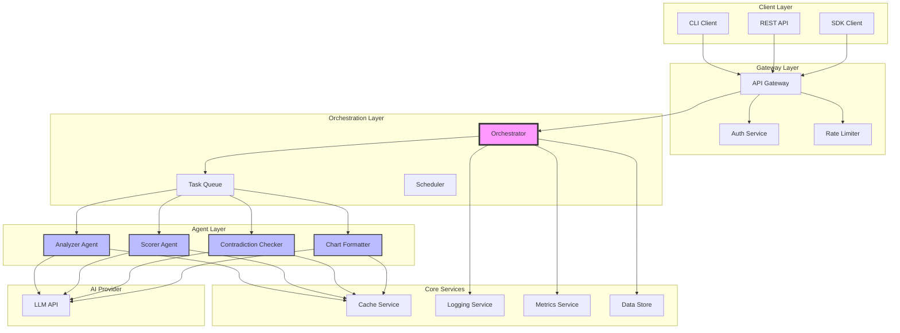
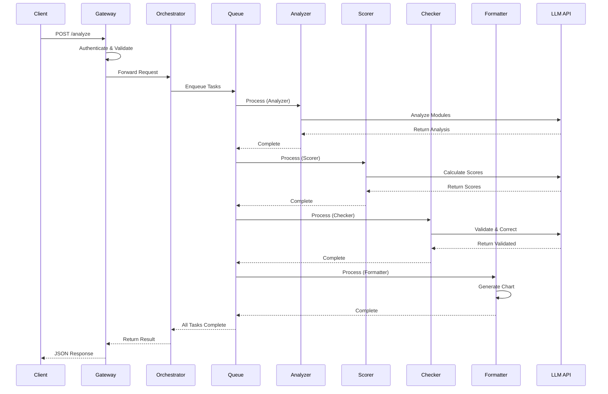
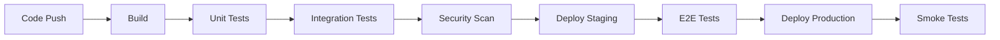

# アーキテクチャドキュメント

## システム全体図



## コンポーネント詳細

### 1. Client Layer

#### CLI Client
- **責務**: コマンドライン経由でのアクセス
- **技術**: Node.js, Commander.js
- **インターフェース**: `ddd-map analyze <input-file>`

#### REST API
- **責務**: HTTPエンドポイントの提供
- **技術**: Express.js / FastAPI
- **エンドポイント**:
  - `POST /api/v1/analyze`
  - `GET /api/v1/results/{id}`
  - `GET /api/v1/health`

#### SDK Client
- **責務**: プログラマティックアクセス
- **言語サポート**: JavaScript, Python, Go
- **使用例**:
```javascript
const client = new DDDMapperClient({ apiKey: 'xxx' });
const result = await client.analyze(inputData);
```

### 2. Gateway Layer

#### API Gateway
- **責務**: ルーティング、認証、レート制限
- **機能**:
  - リクエストバリデーション
  - レスポンス圧縮
  - CORS処理
  - APIキー管理

#### Authentication Service
- **責務**: 認証・認可
- **方式**:
  - APIキー認証
  - JWT認証（オプション）
  - OAuth2.0（将来）

#### Rate Limiter
- **責務**: レート制限とクォータ管理
- **制限**:
  - 100 req/min per API key
  - 1000 req/hour per API key
  - 50 concurrent requests

### 3. Orchestration Layer

#### Orchestrator
- **責務**: ワークフロー管理と調整
- **主要機能**:
  - エージェント委任戦略
  - 状態管理
  - エラーハンドリング
  - 進捗追跡

#### Task Queue
- **責務**: 非同期タスク管理
- **実装**: Redis Queue / RabbitMQ
- **キュー戦略**:
  - Priority Queue（優先度付き）
  - FIFO for same priority
  - Dead Letter Queue for failures

#### Scheduler
- **責務**: バッチ処理とスケジューリング
- **機能**:
  - Cron ジョブ
  - 定期的な再分析
  - リトライスケジューリング

### 4. Agent Layer

各エージェントは独立して動作し、単一責務の原則に従います。

#### Analyzer Agent
```yaml
Input: Raw module data
Output: Subdomain summaries
Processing:
  - Purpose extraction
  - Capability identification
  - Integration point mapping
  - Custom logic assessment
```

#### Scorer Agent
```yaml
Input: Subdomain summaries
Output: S/Δ/X scores
Processing:
  - Strategic importance calculation
  - Differentiation potential assessment
  - Externalizability evaluation
  - Evidence-based scoring
```

#### Contradiction Checker
```yaml
Input: Scored items
Output: Validated items
Processing:
  - Score consistency check
  - Classification validation
  - Evidence verification
  - Self-correction
```

#### Chart Formatter
```yaml
Input: Validated items
Output: Vega-Lite specification
Processing:
  - Data transformation
  - Chart generation
  - Visual encoding
  - Interactive features
```

### 5. Core Services

#### Cache Service
- **実装**: Redis
- **キャッシュ戦略**:
  - LRU eviction
  - TTL: 1 hour default
  - Key pattern: `agent:{name}:{hash}`

#### Logging Service
- **実装**: ELK Stack / CloudWatch
- **ログレベル**: DEBUG, INFO, WARN, ERROR
- **構造化ログ**: JSON format

#### Metrics Service
- **実装**: Prometheus + Grafana
- **メトリクス**:
  - Request latency
  - Agent processing time
  - Error rates
  - Resource utilization

#### Data Store
- **実装**: PostgreSQL / MongoDB
- **スキーマ**:
  - Analysis results
  - Audit logs
  - User configurations
  - Historical data

## データフロー

### 1. 分析リクエストフロー



## セキュリティアーキテクチャ

### 1. 認証・認可

```yaml
authentication:
  methods:
    - api_key:
        header: X-API-Key
        validation: HMAC-SHA256
    - jwt:
        header: Authorization
        algorithm: RS256

authorization:
  rbac:
    roles:
      - admin: full access
      - user: read/write own data
      - viewer: read only
```

### 2. データ保護

- **転送時暗号化**: TLS 1.3
- **保存時暗号化**: AES-256-GCM
- **秘密情報管理**: HashiCorp Vault / AWS Secrets Manager

### 3. 監査とコンプライアンス

- すべてのAPIアクセスをログ記録
- 個人識別情報（PII）のマスキング
- GDPR/CCPA準拠のデータ処理

## スケーラビリティ戦略

### 1. 水平スケーリング

```yaml
scaling:
  agents:
    min_replicas: 2
    max_replicas: 10
    target_cpu: 70%
    target_memory: 80%

  orchestrator:
    min_replicas: 3
    max_replicas: 5
    target_rps: 100
```

### 2. キャッシング戦略

- **L1 Cache**: In-memory (application level)
- **L2 Cache**: Redis (distributed)
- **L3 Cache**: CDN (static assets)

### 3. データベースシャーディング

```sql
-- Sharding by request_id hash
CREATE TABLE analysis_results_00 PARTITION OF analysis_results
FOR VALUES WITH (modulus 4, remainder 0);
```

## 障害対応

### 1. Circuit Breaker パターン

```yaml
circuit_breaker:
  failure_threshold: 5
  recovery_timeout: 60s
  half_open_requests: 3
```

### 2. Retry with Exponential Backoff

```yaml
retry:
  max_attempts: 3
  base_delay: 1s
  max_delay: 10s
  multiplier: 2
```

### 3. Graceful Degradation

- エージェント障害時は簡易版にフォールバック
- LLM API障害時はキャッシュから応答
- 部分的な結果でも返却可能

## デプロイメントアーキテクチャ

### 1. コンテナ構成

```dockerfile
# Base image for agents
FROM node:20-alpine
WORKDIR /app
COPY package*.json ./
RUN npm ci --production
COPY . .
CMD ["node", "agent.js"]
```

### 2. Kubernetes マニフェスト

```yaml
apiVersion: apps/v1
kind: Deployment
metadata:
  name: analyzer-agent
spec:
  replicas: 3
  selector:
    matchLabels:
      app: analyzer
  template:
    metadata:
      labels:
        app: analyzer
    spec:
      containers:
      - name: analyzer
        image: ddd-mapper/analyzer:latest
        resources:
          requests:
            memory: "256Mi"
            cpu: "250m"
          limits:
            memory: "512Mi"
            cpu: "500m"
```

### 3. CI/CD パイプライン



## パフォーマンス最適化

### 1. レスポンスタイム目標

| エンドポイント | P50 | P95 | P99 |
|-------------|-----|-----|-----|
| /analyze | 2s | 5s | 10s |
| /results | 50ms | 100ms | 200ms |
| /health | 10ms | 20ms | 50ms |

### 2. 最適化手法

- **並列処理**: 独立エージェントの並列実行
- **バッチ処理**: 複数モジュールの一括処理
- **ストリーミング**: 大規模データのストリーム処理
- **インデックス最適化**: データベースインデックス戦略

## 技術スタック総覧

| レイヤー | 技術 | 代替案 |
|---------|------|--------|
| Frontend | React/Vue | Svelte, Angular |
| API | Node.js/Express | FastAPI, Go/Gin |
| Queue | Redis Queue | RabbitMQ, AWS SQS |
| Cache | Redis | Memcached, Hazelcast |
| Database | PostgreSQL | MongoDB, DynamoDB |
| Search | Elasticsearch | Solr, Algolia |
| Monitoring | Prometheus/Grafana | DataDog, New Relic |
| Logging | ELK Stack | Splunk, CloudWatch |
| Container | Docker | Podman |
| Orchestration | Kubernetes | Docker Swarm, ECS |
| CI/CD | GitHub Actions | Jenkins, GitLab CI |
| Cloud | AWS | GCP, Azure |